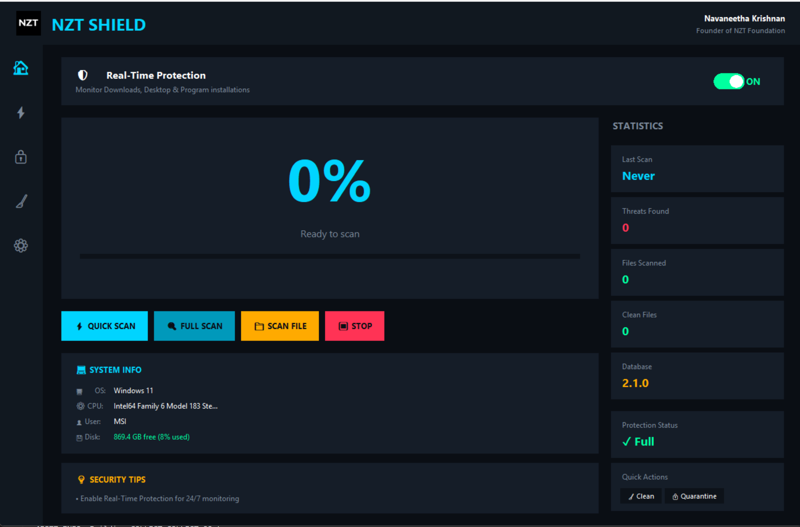

# 🛡️ NZT SHIELD

  

  <strong>Advanced Threat Protection for Windows</strong> 
  Multi-Engine Cloud Scanner • Real-Time Protection • System Cleaner

  
  
  
  

  

---

## ✨ Features

### 🔍 Multi-Engine Scanning
- Cloud-based analysis using **70+ antivirus engines**
- Quick Scan for malware-prone directories (Downloads, Desktop, Program Files)
- Full System Scan for comprehensive protection
- Single file scanning capability

### 🛡️ Real-Time Protection
- Monitors Downloads, Desktop, and Program installations
- Automatic threat detection on new files
- Toggle ON/OFF with a single click

### 🔒 Quarantine Management
- Safely isolate detected threats
- Restore or permanently delete quarantined files
- Protected storage prevents accidental execution

### 🧹 System Cleaner
- Remove temporary files and free up disk space
- Scan Windows temp folders
- One-click cleanup

### 🎨 Modern UI
- Dark cyberpunk theme
- Clean, intuitive navigation
- Real-time scan progress display
- System information dashboard

---

## 📸 Screenshots

| Home | Scan | Settings |
|------|------|----------|
| Progress display, system info, security tips | Scan logs, statistics, targets | Engine status, features, about |

---

## 🚀 Installation

### Prerequisites
- Windows OS
---

## 🎯 Usage

### Quick Scan
Scans high-risk directories where malware commonly resides:
- Downloads
- Desktop
- AppData/Temp
- Program Files

### Full Scan
Comprehensive system scan including:
- All Quick Scan locations
- Windows/System32
- Windows/Temp
- All user profiles

### Real-Time Protection
Enable to automatically scan new files in monitored directories. Threats are immediately quarantined.

### System Cleaner
Remove accumulated temporary files to free up disk space and improve system performance.

---
---

## 🔧 Technical Details

| Component | Details |
|-----------|---------|
| Scan Engine | Multi-Engine Cloud Scanner (70+ AV) |
| Database Version | 2.1.0 |
| Engine Version | 4.2.1 |

---

## 👨‍💻 Developer

**Navaneetha Krishnan**  
*Founder of NZT Foundation*

---

## 📄 License

This project is licensed under the MIT License - see the [LICENSE](LICENSE) file for details.

---

## ⚠️ Disclaimer

NZT Shield is designed for educational and personal use. While it provides real threat detection capabilities, it should be used alongside other security measures for comprehensive protection.

---

  Made with ❤️ by NZT Foundation

